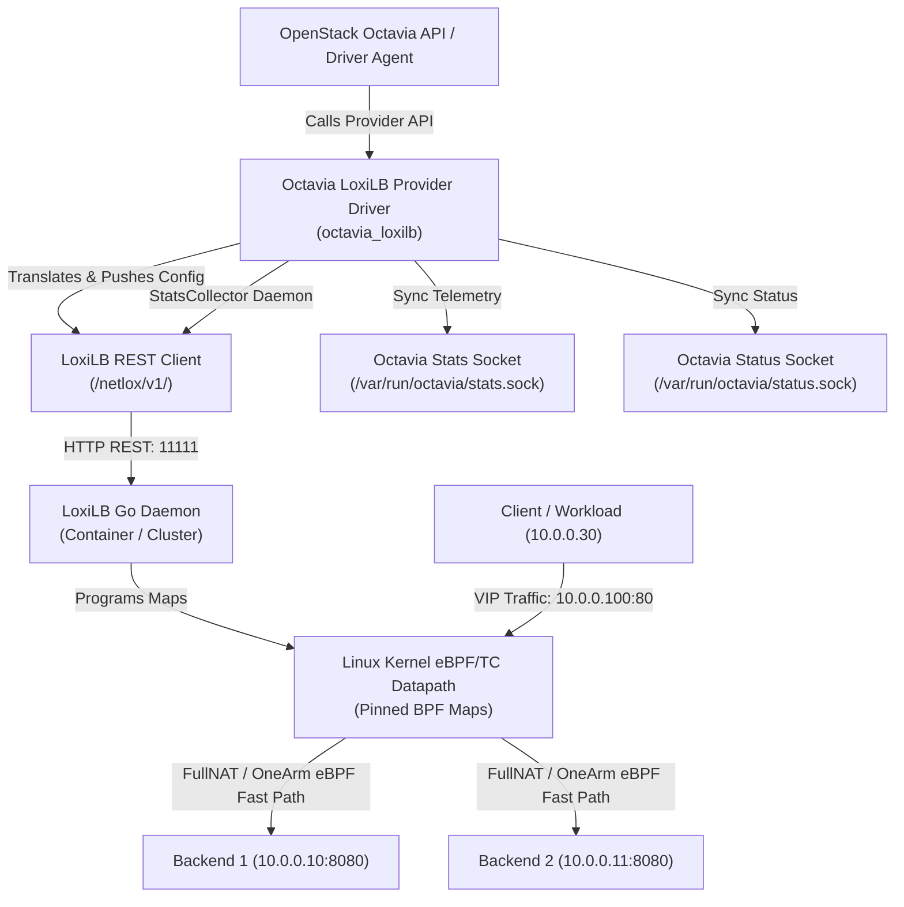

# Octavia–LoxiLB Integration Architecture Guide

**Project**: Octavia–LoxiLB Integration Provider Driver  
**Organization**: Viettel IDC R&D Team  
**OpenStack Release Target**: OpenStack 2024.2 (Caracal / Dalmatian) & beyond  
**Dataplane Core**: LoxiLB eBPF / XDP / TC Engine  

---

## 1. Architectural Overview

The **Octavia–LoxiLB Provider Driver** (`octavia-loxilb`) integrates [LoxiLB](https://github.com/loxilb-io/loxilb) into [OpenStack Octavia](https://docs.openstack.org/octavia/latest/) as a high-performance, native eBPF/XDP load balancing provider.

Unlike the default Octavia Amphora driver—which provisions heavyweight dedicated QEMU virtual machines running userspace HAProxy and Keepalived instances—the LoxiLB provider driver programs a shared, high-throughput, low-latency eBPF datapath directly at the Linux kernel **TC (Traffic Control)** and **XDP (eXpress Data Path)** hooks.

---

## 2. Core Subsystems & Components

### 2.1 Provider Driver Layer (`octavia_loxilb.driver`)
- Inherits from `octavia_lib.api.drivers.provider_base.ProviderDriver`.
- Implements all Octavia resource lifecycle entry-points:
  - `loadbalancer_create`, `loadbalancer_update`, `loadbalancer_delete`
  - `listener_create`, `listener_update`, `listener_delete`
  - `pool_create`, `pool_update`, `pool_delete`
  - `member_create`, `member_update`, `member_delete`, `member_batch_update`
  - `health_monitor_create`, `health_monitor_update`, `health_monitor_delete`
- Manages the background `StatsCollector` daemon thread.

### 2.2 Translation Layer (`octavia_loxilb.translation.translator`)
- Translates hierarchical OpenStack Octavia data trees (`LoadBalancer -> Listener -> Pool -> Members -> HealthMonitor`) into flat LoxiLB `LoadbalanceEntry` schema objects.
- Supported Protocols: `TCP`, `UDP`, `SCTP`.
- Supported Load Balancing Algorithms: `ROUND_ROBIN` (`rr`), `LEAST_CONNECTIONS` (`lc`).
- Supported Health Monitor Types: `TCP`, `HTTP`, `HTTPS`, `UDP`, `SCTP`.
- Supported Session Persistence: `SOURCE_IP` (via persistent conntrack timeout configuration).

### 2.3 LoxiLB REST Client (`octavia_loxilb.client.client`)
- Interacts with LoxiLB management REST API (`/netlox/v1/config/loadbalancer`, `/netlox/v1/config/conntrack/all`).
- Supports endpoint failover across multi-node LoxiLB clusters with automatic retry logic (tenacity).
- Supports HTTP Basic Auth and Bearer Token authentication schemes.

### 2.4 Status & Statistics Synchronizer (`octavia_loxilb.status.synchronizer`)
- **Status Synchronization**: Transmits `ACTIVE` / `ERROR` provisioning and operating status to Octavia via Octavia DriverLibrary over `/var/run/octavia/status.sock`.
- **Periodic Stats Telemetry**: The background `StatsCollector` polls LoxiLB atomic conntrack maps and endpoint counters every `stats_interval` (default 5s) and writes real-time traffic statistics (`bytes_in`, `bytes_out`, `active_connections`, `total_connections`) to `/var/run/octavia/stats.sock`.

---

## 3. Comparison: LoxiLB eBPF vs Amphora HAProxy

| Architecture Dimension | LoxiLB eBPF Provider | Octavia Amphora (HAProxy) |
|---|---|---|
| **Datapath Location** | Linux Kernel eBPF (TC / XDP hooks) | Linux Userspace (`haproxy` daemon) |
| **Context Switches** | **0** (in-kernel packet redirection) | **2 per packet** (Kernel -> User -> Kernel) |
| **Compute Overhead** | Negligible (~50 MB container daemon) | Heavy (1–2 dedicated KVM VMs per LB) |
| **Provisioning Latency** | **< 100 ms** (instant REST call) | **1–3 minutes** (VM boot & cloud-init) |
| **High Availability** | Active-Active ECMP with BGP or GoBGP | Active-Standby VRRP pair (Keepalived) |
| **Scaling Capability** | Millions of packets/sec per core | Limited by userspace socket buffers |

---

## 4. Security & Isolation Model

1. **Kernel Safety**: LoxiLB eBPF bytecode is validated and verified by the Linux Kernel BPF Verifier prior to attaching to TC/XDP hooks, preventing kernel panics, null dereferences, or infinite loops.
2. **Network Isolation**: Operates seamlessly over standard OpenStack Neutron networks (VLAN, Geneve, VXLAN, OVN Logical Switches) with anti-spoofing and security groups.
3. **Transport Security**: Management communication between Octavia Driver and LoxiLB cluster can be secured with TLS, Bearer Token Auth, or Basic Auth.
